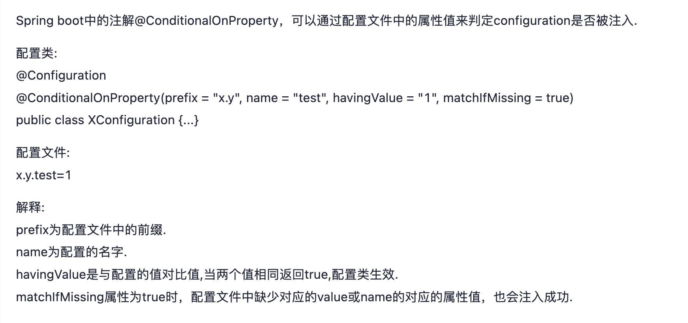
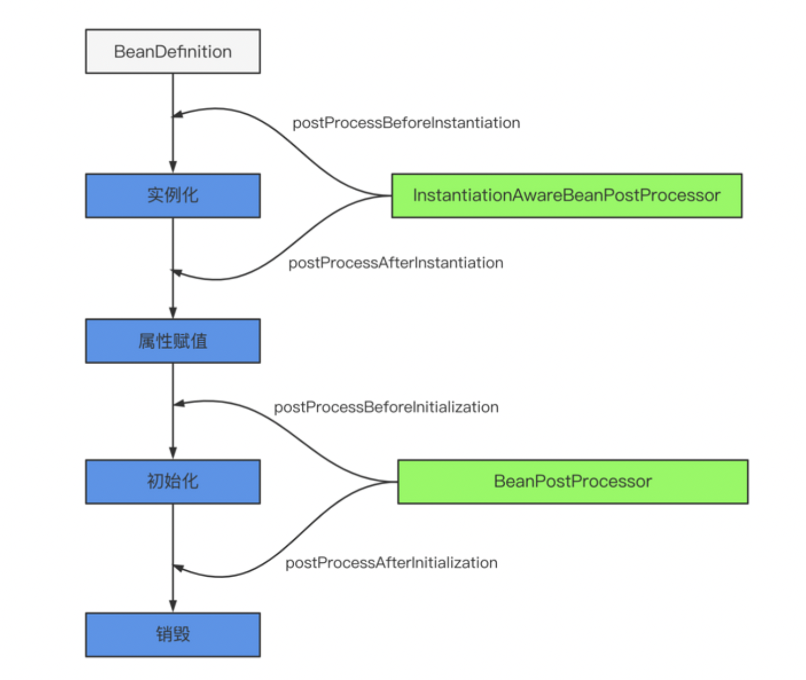

# markdown 书写规则
## 一、图片插入
### 1、网络图片插入

### 2、本地图片插入

# springboot 中的各个annotation 的使用
## @conditionalonproperty 
Spring boot中的注解@ConditionalOnProperty，**可以通过配置文件中的属性值来判定configuration是否被注入.**
[参考文章](https://www.cnblogs.com/LoveShare/p/14431848.html)

# bean 的生命周期
[参考文章](https://segmentfault.com/a/1190000040365130)

## InstantiationAwareBeanPostProcessor
本文中用了 **MyInstantiationAwareBeanPostProcessor** 来验证 